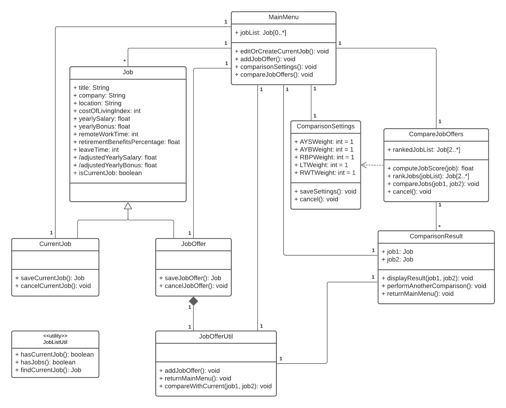

## 1 Individual Designs
### 1.1 Design 1

#### Pros:
* Use 'Job Details' for both 'CurrentJobForm' and 'JobOfferForm' classes, since they display the same set of attributes.
* Use two pages ('ComparisonSelection' and 'ComparisonPage') for comparing job offers, which is more user-friendly than displaying both ranking and comparison result on the same page.
* A clean, concise, and well-structured diagram that could to be easily followed and understood.
* Use aggregation and dependency relationship types for easy understanding of the design structure.

#### Cons:
* Some attributes do not follow UML class diagram conventions but is more of a mixture of a package diagram and component diagram.
* It might be a better idea to include the 'AYS' and 'AYB' as derived attributes in the 'Job Details' class, so whenever a current job or a job offer is saved, these attributes are automatically calculated.
* Lacks accurate relationship and instance types in relation between classes.
* The 'saveJob()' operation from the 'CurrentJobForm' class should directly returns to the 'MainMenu' interface after the data is saved. This was not shown in the design-description document.

### 1.2 Design 2

#### Pros:
* Well maintained format in the UML class diagram and clearly labeled relationships between different classes.
* The design-description document is well written and it answeres many questions about the design.
* Simple and concise while including everything, such as attributes, their types, and class relationships.

#### Cons:
* The 'compareJobOffers(jobOffer, currentJob)' operation in the 'JobOffersUtil' class needs some elaborated explanations on how will it be integrated with the 'CompareJobOffers' class.
* It is not clear how the 'JobOffersUtil' class would be called.

### 1.3 Design 3

#### Pros:
* Use relationship names in the middle of the association line for easy understanding.
* Use separated pages to display job ranking and comparison detail (one page for “Compare Job Offers” class and another page for “Comparison Result” class), which is user-friendly.
* Operations are accurately documented per class.
* Derived fields are accurately captured.

#### Cons:
* Repeat the same set of attributes in both 'Current Job' and 'Job Offer' classes.
* Database is not needed in UML diagram.
* Dotted line double side arrows for the 4 main function classes 'Current Job', 'Job Offer', 'Comparison Setting' and 'Compare Job Offers'. It should be simple association (a solid line) as the 4 functions are associated with 'MainMenu' but not depends on 'MainMenu'.

### 1.4 Design 4

#### Pros:
* Type of attributes are all well-defined.
* Class diagram is clean and easy to follow.

#### Cons:
* No operation under the 'MainMenu' class. Should have 4 operations linked to the 4 classes written in the diagram.
* userID is not required in MainMenu since login is not in the requirement specification.
* Repeat the same set of attributes in both 'EnterEditCurrentJobDetails' and 'EnterJobOffers' classes.
* It would benefit from breaking out the compareJobOffers class into additional possible classes.

## 2 Team Design

### 2.1 Commonalities and Difference between Team and Individual Designs
* All designs capture the five essential classes (with minor naming differences): 'MainMenu', 'CurrentJob', 'JobOffer', 'ComparisonSettings', and 'CompareJobOffers'.

* All designs have relationships between the 'MainMenu' and the other essential classes.

* Team design creates a 'Job' class that is inherited by the 'CurrentJob' and 'JobOffer' classes, which is similar to Design 1 and Design 2, but different from Design 3 and Design 4.

* Team design utilizes a 'ComparisonResult' class to show the comparison result between two jobs, which is similar to Design 1 and Design 3, but different from Design 2 and Design 4.

* Team design employs a 'JobListUtil' utility class to check the stored job array, which is different from all of the individual designs.

* Team design includes a boolean attribute 'isCurrentJob' to determine whether a job is the current job or a job offer, which is similar to Design 1, but different from the other individual designs.

* Team design follows strict UML class diagram format with clear labeling, which is similar to Design 2, but different from the other individual designs.

* Team design includes two derived attributes in the 'Job' class, which is similar to Design 3, but different from the other individual designs.

### 2.2 Reasons behind Team Design Decisions
* The 'CurrentJob' and 'JobOffer' classes have identical attributes. Therefore, redundancy of repeated attributes can be avoided by making these two classes inherit from a single class named 'Job'.

* The final result of comparing two jobs can be accessed from either the 'JobOfferUtil' class or the 'CompareJobOffers' class. However, the former case only needs to show result, while the latter case needs to perform calculation, ranking, selection, and result showing. Thus, a separated class named 'ComparisonResult' is established to streamline and unify both cases, where its sole purpose is to display the comparison result of two input jobs.

* Although the jobs are all stored in the 'jobList' attribute in the 'MainMenu' class, its values might be needed elsewhere, i.e. checking whether a current job exists in the 'JobOfferUtil' class. So, a utility class named 'JobListUtil' is implemented for various tasks, such as check the 'jobList' for current job, check the 'jobList' to see if it has at least two jobs, and find the current job from the 'jobList'.

* When saving job details, there is no need for the 'CurrentJob' and 'JobOffer' classes to be returned as different classes while they have the identical attributes. That is why every job detail is saved as a 'Job' object with a boolean attribute 'isCurrentJob' to distinguish the current job from job offers.

* Out team tries to maintain rigorous UML diagram format when constructing the team design, and Design 2 has the best format among all of our designs. Hence, the final team design is build upon the structure of Design 2, with several modifications.

* Two adjusted values that need to be calculated using the cost of living index are used in both the 'CompareJobOffers' class for job score calculation, and in the 'ComparisonResult' class for result viewing. Consequently, these values are included as derived attributes in the 'Job' class, to avoid repeated definations within the two classes.

## 3 Summary
Some lessons are learned by the whole team in the following aspects:

### 3.1 Process of Discussing Design

* Better to make changes in the UML design during discussion since everybody can comment and explain their ideas immediately.
* Better to comment teammates' work before starting the group discussion such that everybody is acknowledged about the pros & cons in their designs and get prepared for the discussion.
* Better to choose a common ground (i.e. one's UML design) and starting working on it in the first place. It can save a lot of discussion time.

### 3.2 Team Work

* Better to get a consensus on using which communication tool in the first place. Discord is a good tool for both meeting and discussion.
* Better to know each teammate's available schedule for group discussion since someone can be in a different timezone.
* After discussion, better to divide the group deliverable into parts so that each teammate can work on their corresponding piece of work.

### 3.3 Other Aspect

* Better to know each teammate's background (e.g. coding experience and stack used) before kicking in the conversation. See if any similar coding scenario can be used in explaining our designs.
