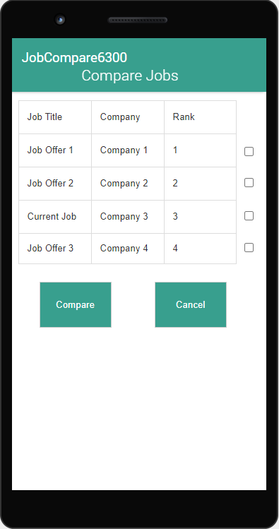

# Design Document 

**Author**: \<Alexander Schneck\> 

## 1 Design Considerations 

### 1.1 Assumptions 

Assumptions: 
* The app will continue to be a single user app. 
* User will have access to a device that can run the API 28: Android 9.0 (Pie) Operating System. 
* Requirements have been set and won't be changed. 
* The scope of the app won't change through the development process. 

Background: 
The user is graduating college soon and would like an app to compare possible job offers in an apples-to-apples comparison that will help facilitate their decision. This application is specific to the user and their requirements for comparison. They have provided a formula to as a preferred method to incorporate cost of living into the comparison.  

Use 
* Be able to enter data for current job. 
* Be able to enter data for job offers. 
* Be able to view ranking of job offers based on a comparison system that assigns weights to different attributes. 
* Be able to compare the details of the two jobs selected on the ranking page. 

Operational Environment 
* This application will be within an the API 28: Android 9.0 (Pie) operating system. 
* It will use Android SQLite for managing and persisting data

Significant Project issues 
* None at this time 

### 1.2 Constraints 
* The team is constrained to building the application within API 28: Android 9.0 (Pie). 
* The customer has requested this to facilitate his/her pursuit of a new job after graduation. This means our application should be completed and tested before his/her graduation in order to ensure an appropriate amount of time to compare job offers. 
* The application should be robust but efficient to ensure it does not use excessive resources on the customer's android device. 

### 1.3 System Environment 
The app will be leveraging the Android app platform. This will make it easier to access for the user while he/she is actively pursuing jobs. The app will be robust and efficient enough to run on any cellphone platform with Android 9.0 (Pie). Leverage Android SQLite to allow the application to persist data between application runs. 

## 2 Architectural Design 
### 2.1 Component Diagram 

### 2.2 Deployment Diagram 
This diagram is not needed for this application as this application will only be deployed to an android device. 

## 3 Low-Level Design 
### 3.1 Class Diagram 

### 3.2 Other Diagrams 

#### User Interface Diagram

## 4 User Interface Design 

