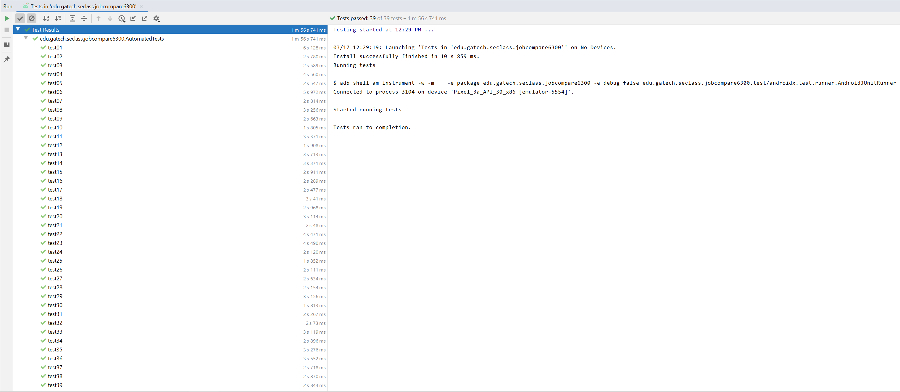

# Test Plan

**Author**: \<Kai Wu\>

Version v3: Updated the sections of test data and automation test, including a summary screenshot.

Version v2: Updated the test cases to reflect current status of application functionality.

Version v1: Created the initial test plan.

## 1 Testing Strategy

### 1.1 Overall strategy

The purpose of this document is to outline the high-level test strategy for the single-user job offers comparison project "JobCompare6300", defining the preliminary test scope, high-level test activities, and organization, together with test management for the project. The test strategy provides the framework for estimating the duration and cost of the testing effort at the required confidence level for the business case.

#### 1.1.1  Test scope and objectives
The app will be tested in [Android Studio]. Unit testing will be performed by the developer [Kai Wu] to rectify any issue during the development cycle, which is not included in this document. System integration testing will be performed by [Team 82] manually in the preliminary stage, and by the automated test script designed by [Kai Wu] in the final stage, to ensure the functionality of this app.

##### 1.1.1.1 In scope
Following functionalities will be tested based on the [Software Design] document.
1. User can start the app and the [Main Menu] UI will be displayed.
2. User can proceed to the [Current Job] UI if click on the [Current Job] button on the [Main Menu] UI.
3. User can proceed to the [Job Offer] UI if click on the [Job Offer] button on the [Main Menu] UI.
4. User can proceed to the [Comparison Settings] UI if click on the [Comparison Settings] button on the [Main Menu] UI.
5. User can proceed to the [Compare Jobs] UI if click on the [Compare Jobs] button on the [Main Menu] UI.
6. User can proceed to the [Main Menu] UI if click on the [Save] button on the [Current Job] UI.
7. User can proceed to the [Main Menu] UI if click on the [Cancel] button on the [Current Job] UI.
8. User can proceed to the [Job Offer Until] UI if click on the [Save] button on the [Job Offer] UI.
9. User can proceed to the [Job Offer] UI if click on the [Add Another Offer] button on the [Job Offer Util] UI.
10. User can proceed to the [Main Menu] UI if click on the [Return To Main Menu] button on the [Job Offer Util] UI.
11. User can proceed to the [Comparison Result] UI if click on the [Compare With Current Job] button on the [Job Offer Util] UI.
12. User can proceed to the [Main Menu] UI if click on the [Cancel] button on the [Comparison Settings] UI.
13. User can proceed to the [Comparison Result] UI if click on the [compare] button on the [Compare Jobs] UI.
14. User can proceed to the [Compare Jobs] UI if click on the [perform Another Comparison] button on the [Comparison Result] UI.
15. User can proceed to the [Main Menu] UI if click on the [Return To Main Menu] button on the [Comparison Result] UI.
16. Job details should be saved to the SQLite database correctly, after proper handling invalid values by setting error texts.
17. Job details should be retrieved from the SQLite database correctly, and displayed on the [Current Job] and the [Comparison Result] UIs.
18. Job details of the current job should be displayed with a "*" before the title on the [Current Job] and the [Comparison Result] UIs.
19. Some buttons should be disabled first, and re-enabled under certain circumstances.
20. Calculation of job scores and ranking jobs according to their scores should be performed correctly and reflected on the [Compare Jobs] UI.

##### 1.1.1.2 Out of scope
Performance & load testing, security testing, and user acceptance testing are not considered in this project.

#### 1.1.2 Test methodology
Agile test methodology will be performed in this project.

### 1.2 Test Selection
Both black-box and white-box testing techniques will be used. While the black-box testing is applied when testing the app manually in the preliminary stage, the white-box testing is introduced for the automated test in the final stage.

#### 1.2.1 White-box techniques
Statement Coverage, Decision Coverage, Branch Coverage

#### 1.2.2 Black-box techniques
Boundary Value Analysis, State Transition Testing, Negative Testing

### 1.3 Adequacy Criterion
Test cases are designed to reveal failure scenarios of the app. Therefore, designing multiple test cases that can cover all the structural and functional requirements is essential. For the unit level testing, the test cases should cover basic functions required for that unit. For the system level testing, the quality of the test cases are considered adequate if all the aspects of the app are considered and effectively covered without redundancy. The entry and exit criteria of system level testing are described in the following subsections.

#### 1.3.1 Entry Criteria
The app must meet the criteria below before system test.
1. All basic functionalities must work.
2. All unit tests run without error.
3. All known problems posted to the bug-tracking file.

#### 1.3.2 Exit Criteria
The app must meet the criteria below before it can exit from system test.
1. All system tests executed.
2. There are 0 showstopper bugs.
3. There are fewer than <x> major bugs (sever or medium severity level), and <y> minor bugs (low severity level).

### 1.4 Bug Tracking

Any issues, bugs, and enhancement requests discovered during testing will be posted under this section with a table to log the following information:

Description | Time Created | Time Modified | Severity Level | Priority Level | Status
--- | --- | --- | --- | --- | ---
Comparison Setting page cannot return to MainMenu after clicking "SAVE"|07:41 Mar 13, 2021|13:24 Mar 17, 2021|Low|Low|closed with design modification|
Missing "Compare Jobs" heading banner on the Compare Jobs page|09:51 Mar 13, 2021|13:24 Mar 17, 2021|Low|Low|closed with successfully fix|

### 1.5 Technology

Test cases from the functional and system integration testing, shown in section 2, will be designed and facilitated automatically using JUnit as the testing tool, which can be found in

*edu.gatech.seclass.jobcompare6300(androidTest)/AutomatedTests*

## 2 Test Cases

### 2.1 Test Data

Test data used in the manual and automated tests is illustrated in this section.

The job table is shown in the table below:

|             | Title         | Company         | Location          | COL Index | YS       | YB      | RBP  | LT | RWT | AYS      | AYB      | Job Score (Modified Weight)|
|-------------|---------------|-----------------|-------------------|-----------|----------|---------|------|----|-----|----------|----------|----------------------------|
| current job | Current Title | Current Company | Toronto, ON       | 177       | 80000.0  | 40000.0 | 0.50 | 60 | 5   | 45197.74 | 22598.87 | 13327.54                   |
| job offer 1 | Offer Title 1 | Offer Company 1 | San Francisco, CA | 232       | 100000.0 | 20000.0 | 0.20 | 30 | 3   | 43103.45 | 8620.69  | 6355.00                    |
| job offer 2 | Offer Title 2 | Offer Company 2 | New York City, NY | 235       | 120000.0 | 30000.0 | 0.35 | 45 | 2   | 51063.83 | 12765.96 | 9761.05                    |
| job offer 3 | Offer Title 3 | Offer Company 3 | Washington D.C.   | 206       | 130000.0 | 10000.0 | 0.15 | 38 | 3   | 63106.80 | 4854.37  | 8155.34                    |
| job offer 4 | Offer Title 4 | Offer Company 4 | Philadelphia, PA  | 162       | 90000.0  | 34000.0 | 0.45 | 22 | 4   | 55555.56 | 20987.65 | 12292.66                   |
| job offer 5 | Offer Title 5 | Offer Company 5 | Baltimore, MD     | 157       | 110000.0 | 15000.0 | 0.22 | 10 | 1   | 70063.69 | 9554.14  | 7410.75                    |

The weight table is shown in the table below:

|                 | AYS | AYB | RBP | LT | RWT |
|-----------------|-----|-----|-----|----|-----|
| Default Weight  | 1   | 1   | 1   | 1  | 1   |
| Modified Weight | 1   | 2   | 3   | 4  | 5   |

### 2.2 Manual Test Results

The preliminary test results are acquired manually, as shown in the table below:

| Test Case # | Pass or Fail | Functionality                                                                                                                           | Purpose                                                                    | Steps to Perform Test                                                                                                                                        | Description            | Expected   Result                                                                                                                                                                                                                          | Actual Result                                                                                                                                                                                                                              | Comments                                                               |
|-------------|--------------|-----------------------------------------------------------------------------------------------------------------------------------------|----------------------------------------------------------------------------|--------------------------------------------------------------------------------------------------------------------------------------------------------------|------------------------|--------------------------------------------------------------------------------------------------------------------------------------------------------------------------------------------------------------------------------------------|--------------------------------------------------------------------------------------------------------------------------------------------------------------------------------------------------------------------------------------------|------------------------------------------------------------------------|
| 1           | Pass         | start the app                                                                                                                           | To test whether   application can turn on                                  | 1) Build   application if launching from Android Studio, else ignore this step. 2) Click   on application in mobile or boot up application on Android Studio | Requirement 1          | [Main Menu] screen   is displayed.                                                                                                                                                                                                         | [Main Menu] screen   is displayed.                                                                                                                                                                                                         | Application opened   up upon successful build                          |
| 2           | Pass         | [editOrCreateCurrentJob] button on [Main   Menu] screen                                                                                 | To test edit or create current job   functionality                         | 1) Launch application, 2) Click on   Current Job Button, 3) Input respective information                                                                     | Requirement 1(1)       | [CurrentJob] screen is displayed if click   on [editOrCreateCurrentJob] button on [Main Menu] screen.                                                                                                                                      | [CurrentJob] screen is displayed if click   on [editOrCreateCurrentJob] button on [Main Menu] screen.                                                                                                                                      | Current job button functioned as expected                              |
| 3           | Pass         | [addJobOffer] button on [Main Menu]   screen                                                                                            | To test add job offer functionality                                        | 1) Launch application, 2) Click on Job   Offer, 3) Input respective Information                                                                              | Requirement 1(2)       | [JobOffer] screen is displayed if click   on [addJobOffer] button on [Main Menu] screen.                                                                                                                                                   | [JobOffer] screen is displayed if click   on [addJobOffer] button on [Main Menu] screen.                                                                                                                                                   | Job offer button functioned as expected                                |
| 4           | Pass         | [comparisonSettings] button on [Main   Menu] screen                                                                                     | To test comparison settings   functionality                                | 1) Launch application, 2) Click on   Comparison Settings, 3) Input respective Information                                                                    | Requirement 1(3)       | [ComparisonSettings] screen is displayed   if click on [comparisonSettings] button on [Main Menu] screen.                                                                                                                                  | [ComparisonSettings] screen is displayed   if click on [comparisonSettings] button on [Main Menu] screen.                                                                                                                                  | Comparison settings button worked as   intended                        |
| 5           | Pass         | [compareJobOffers] button on [Main Menu]   screen                                                                                       | To test compare job offers functionality                                   | 1) Launch application, 2) Click on   Compare Job Offers, 3) View inputted information                                                                        | Requirement 1(4)       | [CompareJobOffers] screen is displayed if   click on [compareJobOffers] button on [Main Menu] screen.                                                                                                                                      | [CompareJobOffers] screen is displayed if   click on [compareJobOffers] button on [Main Menu] screen.                                                                                                                                      | This compare job offers capability works   as intended                 |
| 6           | Fail         | [compareJobOffers] button is disabled on   [Main Menu] screen if no job offers entered                                                  | To test application logic of being able   to compare only one or more jobs | 1) Launch application, 2) Click on   Compare Job Offers                                                                                                      | Requirement 1(4)       | [compareJobOffers] button is gray out on   [Main Menu] screen if no job offers were entered.                                                                                                                                               | [compareJobOffers] button is not grayed   out on [Main Menu] screen if no job offers were entered.                                                                                                                                         | Job offer button is not grayed out prior   to no offers being inputted |
| 7           | Pass         | [compareJobOffers] button is NOT disabled   on [Main Menu] if no job offers entered                                                     | To test application logic of being able   to compare only one or more jobs | 1) Launch application, 2) Click on   Compare Job Offers                                                                                                      | Requirement 1(4)       | [compareJobOffers] button is NOT gray out   on [Main Menu] screen if job offers were entered.                                                                                                                                              | [compareJobOffers] button is not grayed   out on [Main Menu] screen if no job offers were entered.                                                                                                                                         | Job offer button is not grayed out prior   to no offers being inputted |
| 8           | Pass         | [CurrentJob] screen entities                                                                                                            | To test and identify current job screen   entities                         | 1) Launch application, 2) Click on   Current Job Button                                                                                                      | Requirement 2a         | "title, company, location,   costOfLivingindex, yearlySalary, yearlyBonus, remoteWorkTime,   retirementBenefitsPercentage, leaveTime" entities should be displayed on   [CurrentJob] screen.                                               | "title, company, location,   costOfLivingindex, yearlySalary, yearlyBonus, remoteWorkTime,   retirementBenefitsPercentage, leaveTime" entities are displayed on   [CurrentJob] screen.                                                     | Respective fields are displayed on   current job screen                |
| 9           | Pass         | [CurrentJob] screen entities                                                                                                            | To test and validate current job screen   entities                         | 1) Launch application, 2) Click on   Current Job Button                                                                                                      | Requirement 2a         | Validate "title, company, location,   costOfLivingindex, yearlySalary, yearlyBonus, remoteWorkTime,   retirementBenefitsPercentage, leaveTime" entities s on [CurrentJob]   screen.                                                        | Validate "title, company, location,   costOfLivingindex, yearlySalary, yearlyBonus, remoteWorkTime,   retirementBenefitsPercentage, leaveTime" entities on [CurrentJob]   screen.                                                          | Respective entities are present on   current job screen                |
| 10          | Pass         | [saveCurrentJob] button on [CurrentJob]   screen                                                                                        | To test save current job button   functionality                            | 1) Launch application, 2) Click on   Current Job Button, 3) Click Save Current Job                                                                           | Requirement 2b         | [Main Menu] screen is displayed if click   on [saveCurrentJob] button on [CurrentJob] screen.                                                                                                                                              | [Main Menu] screen is displayed if click   on [saveCurrentJob] button on [CurrentJob] screen.                                                                                                                                              | Job information is saved and taken to   main menu                      |
| 11          | Pass         | [CancelCurrentJob] button on [CurrentJob]   screen                                                                                      | To test cancel current job button   functionality                          | 1) Launch application, 2) Click on   Current Job Button, 3) Click Cancel Current Job                                                                         | Requirement 2b         | [Main Menu] screen is displayed if click   on [cancelCurrentJob] button on [CurrentJob] screen.                                                                                                                                            | [Main Menu] screen is displayed if click   on [cancelCurrentJob] button on [CurrentJob] screen.                                                                                                                                            | Clicking on cancel current job prompts   user back to the main menu    |
| 12          | Pass         | exit [CurrentJob] screen                                                                                                                | To test exit current job button   functionality                            | 1) Launch application, 2) Click on   Current Job Button, 3) Click exit                                                                                       | Requirement 2b         | [Main Menu] screen is displayed exit on   [CurrentJob] screen.                                                                                                                                                                             | [Main Menu] screen is displayed exit on   [CurrentJob] screen.                                                                                                                                                                             | Main menu is prompted upon exitting of   current job screen            |
| 13          | Pass         | [JobOffer] screen entities                                                                                                              | To test and identify job offer screen   entities                           | 1) Launch application, 2) Click on Job   Offer, 3) Input respective Information                                                                              | Requirement 3a         | "title, company, location,   costOfLivingindex, yearlySalary, yearlyBonus, remoteWorkTime,   retirementBenefitsPercentage, leaveTime" entities should be displayed on   [JobOffer] screen.                                                 | "title, company, location,   costOfLivingindex, yearlySalary, yearlyBonus, remoteWorkTime,   retirementBenefitsPercentage, leaveTime" entities should be displayed on   [JobOffer] screen.                                                 | Respective fields are displayed on   current job screen                |
| 14          | Pass         | [JobOffer] screen entities                                                                                                              | To test and validate job offer screen   entities                           | 1) Launch application, 2) Click on Job   Offer, 3) Input respective Information                                                                              | Requirement 3a         | Validate "title, company, location,   costOfLivingindex, yearlySalary, yearlyBonus, remoteWorkTime,   retirementBenefitsPercentage, leaveTime" entities on [JobOffer] screen.                                                              | Validate "title, company, location,   costOfLivingindex, yearlySalary, yearlyBonus, remoteWorkTime,   retirementBenefitsPercentage, leaveTime" entities on [JobOffer] screen.                                                              | Respective entities are present on   current job screen                |
| 15          | Pass         | [saveJobOffer] button on [JobOffer]   screen                                                                                            | To test save job offer button on job   offer screen                        | 1) Launch application, 2) Click on Job   Offer, 3) Save Job offer                                                                                            | Requirement 3b & 3c(1) | [JobOfferUtil] screen is displayed if   click on [saveJobOffers] button on [JobOffer] screen.                                                                                                                                              | [JobOfferUtil] screen is displayed if   click on [saveJobOffers] button on [JobOffer] screen.                                                                                                                                              | Application is prompted to Job offer   screen                          |
| 16          | Pass         | [cancelJobOffer] button on [JobOffer]   screen                                                                                          | To test cancel job offer button on job   offer screen                      | 1) Launch application, 2) Click on Job   Offer, 3) Cancel Job offer                                                                                          | Requirement 3b & 3c(2) | [Main Menu] screen is displayed if click   on [cancelJobOffers] button on [JobOffer] screen.                                                                                                                                               | [Main Menu] screen is displayed if click   on [cancelJobOffers] button on [JobOffer] screen.                                                                                                                                               | Application is prompted back to main menu                              |
| 17          | Pass         | [addJobOffer] button on [JobOfferUtil]   screen                                                                                         | To test add job offer functionality on   Job offer utility Screen          | 1) Launch application, 2) Click on Job   Offer, 3) Add Job Offer                                                                                             | Requirement 3c(1)      | [JobOffer] screen is displayed if click   on [addJobOffer] button on [JobOfferUtil] screen.                                                                                                                                                | [JobOffer] screen is displayed if click   on [addJobOffer] button on [JobOfferUtil] screen.                                                                                                                                                | Job offer screen is displayed if add Job   offer button is selected    |
| 18          | Pass         | [returnMainMenu] button on [JobOfferUtil]   screen                                                                                      | To test return to main menu functionality   on job offer utility screen    | 1) Launch application, 2) Click on Job   Offer, 3) Return to Main Menu                                                                                       | Requirement 3c(2)      | [Main Menu] screen is displayed if click   on [returnMainMenu] button on [JobOfferUtil] screen.                                                                                                                                            | [Main Menu] screen is displayed if click   on [returnMainMenu] button on [JobOfferUtil] screen.                                                                                                                                            | Prompted to main menu                                                  |
| 19          | Pass         | [compareWithCurrent] button on   [JobOfferUtil] screen                                                                                  | To test compare job functionality on job   screen                          | 1) Launch application, 2) Click on   Compare Job Offers                                                                                                      | Requirement 3c(3)      | [ComparisonResult] screen is displayed if   click on [compareWithCurren] button on [JobOfferUtil] screen.                                                                                                                                  | [ComparisonResult] screen is displayed if   click on [compareWithCurren] button on [JobOfferUtil] screen.                                                                                                                                  | Results are able to be compared                                        |
| 20          | Fail         | [compareWithCurrent] button is disabled   on [JobOfferUtil] screen if less than 2 jobs (current job included)                           | To test compare job functionality if less   than 2 jobs present            | 1) Launch application, 2) Click on   Compare Job Offers                                                                                                      | Requirement 3c(3)      | [compareWithCurrent] button is gray out   on [JobOfferUtil] if less than 2 jobs (current job included) entered.                                                                                                                            | [compareWithCurrent] button is NOT gray   out on [JobOfferUtil] if more than or equal to 2 jobs (current job included)   entered.                                                                                                          | Button is not grayed out                                               |
| 21          | Pass         | [compareWithCurrent] button is NOT   disabled on [JobOfferUtil] screen if more than or equal to 2 jobs (current   job included) entered | To test compare job functionality if less   than 2 jobs present            | 1) Launch application, 2) Click on   Compare Job Offers                                                                                                      | Requirement 3c(3)      | [compareWithCurrent] button is NOT gray   out on [JobOfferUtil] if more than or equal to 2 jobs (current job included)   entered.                                                                                                          | [compareWithCurrent] button is NOT gray   out on [JobOfferUtil] if more than or equal to 2 jobs (current job included)   entered.                                                                                                          | Button is not grayed out                                               |
| 22          | Pass         | [ComparisonSettings] screen entities                                                                                                    | To test and identify comparison settings   screen entities                 | 1) Launch application, 2) Click on   Comparison Settings, 3) Input respective Information                                                                    | Requirement 4          | "Possbility to work remotely, Yearly   salary, Yearly bonus, Retirement benefits, Leave time" entities should   be displayed on [ComparisonSettings] screen.                                                                               | "Possbility to work remotely, Yearly   salary, Yearly bonus, Retirement benefits, Leave time" entities should   be displayed on [ComparisonSettings] screen.                                                                               | Respective fields are displayed on   comparison settings screen        |
| 23          | Pass         | [ComparisonSettings] screen entities                                                                                                    | To test and validate comparison settings   screen entities                 | 1) Launch application, 2) Click on   Comparison Settings, 3) Input respective Information                                                                    | Requirement 4          | Integer numbers can be entered into   "Possbility to work remotely, Yearly salary, Yearly bonus, Retirement   benefits, Leave time" entities.                                                                                              | Integer numbers can be entered into   "Possbility to work remotely, Yearly salary, Yearly bonus, Retirement   benefits, Leave time" entities.                                                                                              | Only integer numbers are able to be   inputted into entities           |
| 24          | Pass         | [CompareJobOffers] screen ranked results                                                                                                | To test compare job offers functionality   with screen ranked results      | 1) Launch application, 2) Click on   Compare Job Offers, 3) View inputted information                                                                        | Requirement 5a         | List of job offers with "Title,   Company" entities is displayed based on ranking from best to worst, and   including the current job if present.                                                                                          | List of job offers with "Title,   Company" entities is displayed based on ranking from best to worst, and   including the current job if present.                                                                                          | Respective fields are displayed on   comparison settings screen        |
| 25          | Pass         | Compare two jobs on [CompareJobOffers]   screen                                                                                         | To test functionality of comparing two   job offers                        | 1) Launch application, 2) Click on   Compare Job Offers, 3) View inputted information                                                                        | Requirement 5b         | [ComparisonResult] screen is displayed if   select two jobs on [CompareJobOffers] screen.                                                                                                                                                  | [ComparisonResult] screen is displayed if   select two jobs on [CompareJobOffers] screen.                                                                                                                                                  | Comoparison result screen is prompted                                  |
| 26          | Pass         | [ComparisonResult] screen entities                                                                                                      | To test functionality of objects when   comparing job results              | 1) Launch application, 2) Click on   Compare Job Offers, 3) View inputted information                                                                        | Requirement 5c         | "Title, Company, Location, Yearly   salary adjusted for cosst of living, Yearly bonus adjusted for cost of   living, Retirement benefits, Leave time" entities should be displayed   for each job as a table on [ComparisonResult] screen. | "Title, Company, Location, Yearly   salary adjusted for cosst of living, Yearly bonus adjusted for cost of   living, Retirement benefits, Leave time" entities should be displayed   for each job as a table on [ComparisonResult] screen. | Respective fields are displayed on   comparison settings screen        |
| 27          | Pass         | [performAnothereComparison] button on   [ComparisonResult] screen                                                                       | To test compare another job on comparison   result screen                  | 1) Launch application, 2) Click on   Compare Job Offers, 3) View inputted information 4) Select another job to   compare                                     | Requirement 5d         | [CompareJobOffers] screen is displayed if   click on [performAnotherComparison] button on [ComparisonResult] screen.                                                                                                                       | [CompareJobOffers] screen is displayed if   click on [performAnotherComparison] button on [ComparisonResult] screen.                                                                                                                       | Compare job offers screen is prompted                                  |
| 28          | Pass         | [returnMainMenu] button on   [ComparisonResult] screen                                                                                  | To test return to main menu functionality   on comparison result screen    | 1) Launch application, 2) Click on   Compare Job Offers, 3) View inputted information 4) Select Return to Main   Menu option                                 | Requirement 5d         | [Main Menu] screen is displayed if click   on [returnMainMenu] button on [ComparisonResult] screen.                                                                                                                                        | [Main Menu] screen is displayed if click   on [returnMainMenu] button on [ComparisonResult] screen.                                                                                                                                        | Main menu is prompted                                                  |
| 29          | Pass         | Job's score on [ComparisonResult] screen                                                                                                | To test successful computation of job   score on comparison result screen  | 1) Launch application, 2) Click on   Compare Job Offers, 3) Select two job offers, 4) View Job score                                                         | Requirement 6          | Job score is displayed on   [ComparisonResult] screen if valid AYS, AYB, RBP, LT, RWT are entered.                                                                                                                                         | Job score is displayed on   [ComparisonResult] screen if valid AYS, AYB, RBP, LT, RWT are entered.                                                                                                                                         | Job score is present                                                   |
| 30          | Pass         | Job's score on [ComparisonResult] screen                                                                                                | To test successful computation of job   score on comparison result screen  | 1) Launch application, 2) Click on   Compare Job Offers, 3) Select two job offers, 4) View Job score                                                         | Requirement 6          | Validate job score is calculated   correctly on [ComparisonResult] screen.                                                                                                                                                                 | Validate job score is calculated   correctly on [ComparisonResult] screen.                                                                                                                                                                 | Job score is accurate based on formula                                 |

### 2.3 Automation Test Results

The final test results are acquired using JUnit automation test, which must be run from a clean AVD, and the scripts can be found in

*edu.gatech.seclass.jobcompare6300(androidTest)/AutomatedTests*.

Please note that the test cases in the automation test is obtained from modifying the preliminary test cases, that includes adding new cases, revising existing cases, and re-ordering of cases. There will be 39 test cases in total, with their purposes clearly indicated in the comment sections above each of them. Below is the test summary screenshot:
